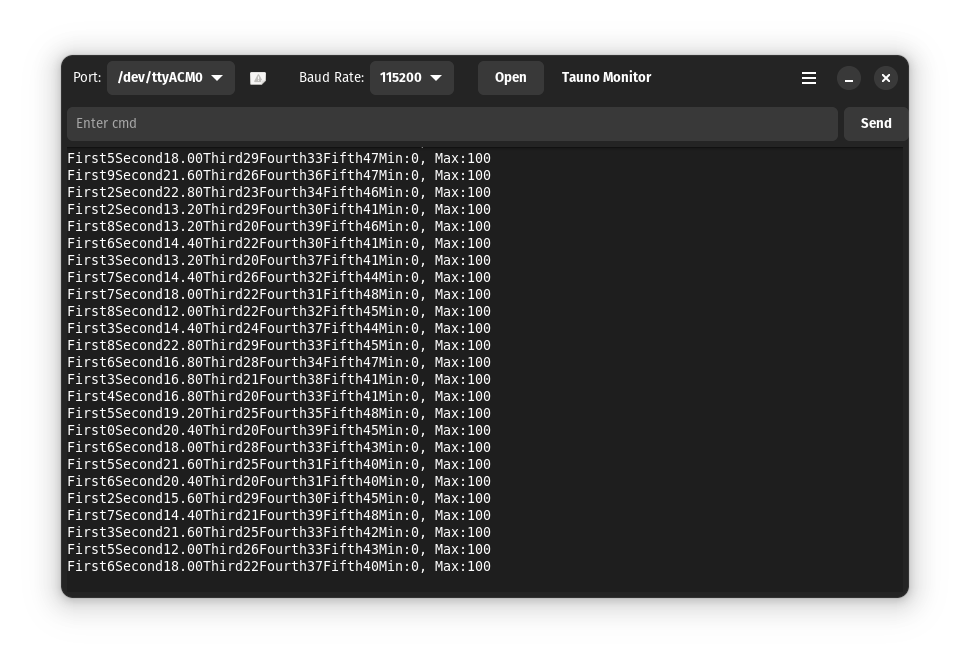
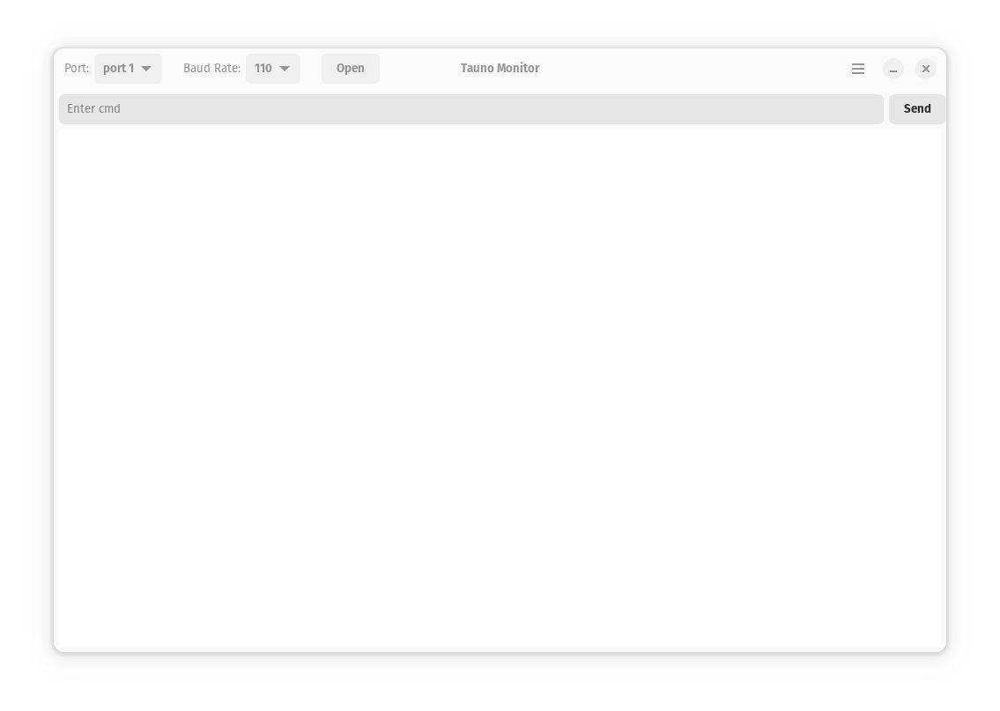

# Tauno Monitor

The goal is to make a stand-alone simple serial port monitor for the GNOME desktop.

It aims to be beginner-friendly, small and easy to use. Not feature-rich and professional.

It remembers the last settings (Theme, Baud Rate, Port).

## Screenshots

