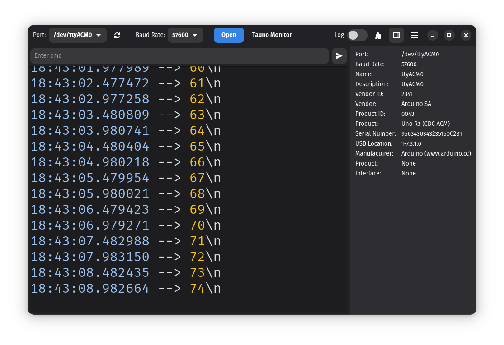

# Tauno Monitor

The goal is to make a stand-alone simple serial port monitor for the GNOME desktop.

It aims to be beginner-friendly, small and easy to use. Not feature-rich and professional.

It remembers the last settings (Theme, Baud Rate, Port etc), auto reconnects to the serial port and can log data to a file.

## Important

Depending on your system you may need to add a user to dialout group to open serial ports:

```bash
sudo usermod -a -G dialout $USER
sudo usermod -a -G plugdev $USER
```

You may also need to install udev rules. PlatformIO have a good [instructions](https://docs.platformio.org/en/latest/core/installation/udev-rules.html)

## Screenshots





## Install

### Flatpak

[](https://flathub.org/apps/art.taunoerik.tauno-monitor)

### Snap

[](https://snapcraft.io/tauno-monitor)

Ubuntu users also must enable "Access USB hardware directly" on the Ubuntu Store Software store:


or from command line:

```bash
snap connect tauno-monitor:raw-usb
```

## Build

You can build Tauno Monitor using [GNOME Builder](https://flathub.org/et/apps/org.gnome.Builder): import the project and press the Play button.

## Support

<a href="https://www.buymeacoffee.com/taunoerik" target="_blank"></a>

 ___

Copyright 2023-2024 Tauno Erik https://taunoerik.art
